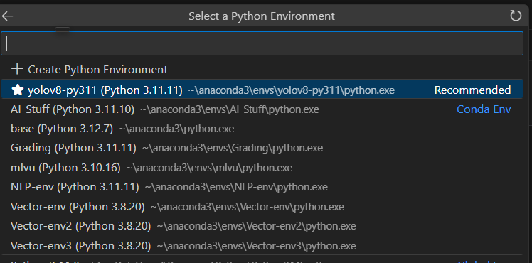

# Vector Detection Model
This repository will provide you with an intuitive guide to enable your Vector to see and identify other Anki Vectors alike with tight bounding boxes. 


# What is YOLO and why? 
**YOLO (You Only Look Once)** is a fast, single-stage object detection algorithm that processes an entire image in one forward pass of the neural network. This makes it extremely efficient and well-suited for real-time applications, such as detecting an Anki Vector robot in various environments.

For this project, I used a lightweight YOLO model along with transfer learning. Instead of training from scratch, I started with a pre-trained YOLO model that had already learned to detect a wide range of objects. I then fine-tuned this model on my custom dataset of Anki Vector images. This approach significantly reduces training time while still achieving high accuracy tailored to the specific task.


## Setup & Run 

1. Clone Repo
```
git clone https://github.com/mparekh99/VectorDetection.git 
```


2. Create the conda environment:

```
conda env create -f env.yaml
conda activate yolov8-py311
```

3. Open in Visual Studio Code and select the kernel as the new one you just created: 



4. Edit train and val paths in **data.yaml** to match the path to the current root directory you in. 

5. Run all cells in **YOLO.ipynb**

6. A **/runs/** directory should be created. Here you can find model metrics and performance. Additionally you can get the outputed models best weights with going to path: 
"runs\detect\yolov8_fine_tuning\weights\best.pt"

 With the given dataset this is the models output.


 7. Additionally I've supplied a video taken from the vector's front camera, to test in video format how well the model creates bounding boxes and generalizes. Feel free to try more!!

 Resulting video should be: Show gif of video. 
